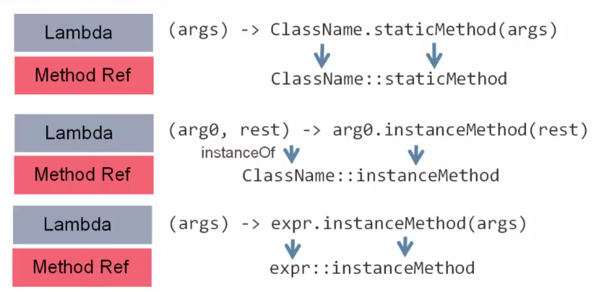
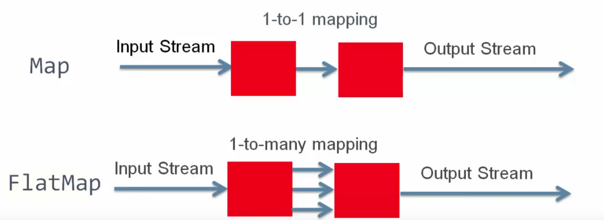

#### Why Need Lambda Expressions:

* Concurrency in Java:

From the beginning Java had the concept of being able to support multiple threads of execution.

> JDK 1.0: java.lang.Thread
Allowed you to create separate threads.
The problem with this, is that when we had several threads all which wanted to work together, to share data and to be able to coordinate their activities, to certain points in time, then you are quite restricted in what you can do with the thread.

Essetially 4 methods:
    - sleep
    - interrupt
    - wait
    - notify

And writing code to do shuch a job using those APIs is actually very difficult.

> JDK 5.0: java.util.concurrent
Box of classes and API's that made this coordination of multiple threades simpler.
Things like Semaphore class, like new mutexes, read/write locks, atomic operations...

> JDK 6: Phasers, etc
More advanced features like Phasers (other way of having multiple threads all working simultaneously and then arriving at a particular point in time so they could deliver a particular set of results).

> JDK 7: Fork/Join Framework
The ability to take a single task which can be broken down into multiple sub tasks and have that happen recursively until you get to a small enough task that could be handled by single thread.  
The framework takes care of creating a pool of threads to use, it takes care of allocating various tasks to the different queues associated with those threads, and then it takes care of gathering all the results together once the queues have been processed and delivering the final result.

It required a good code to use that effectively.


> JDK 8: Project Lambda
Made some changes to the language syntax that we could then use in conjunction with new API's to make the job simpler.

It is primarily created to make life easier for developers to write parallel code that could work in a simple way.


* The Problem: External Iteration:

```
List<Student> students = ...
double highestScore = 0.0;

for (Student s : students) {
    if (s.getGradYear() == 2011) {
        if (s.getScore() > highestScore)
	    highestScore = s.getScore();
    }
}
```
-> The problem is in term of how we will take advantage of multiple cores and multiple processors.

- Our code controls iteration
    We are having a loop in which we are defining the order in which the elements of that loop are going to be processed.
    We will have a contract between the code (compiler) and runtime that states the order in which the elements will be processed in.
- Inherently serial: iterate from beginning to end
- Not thread-safe: (multiple threads can update the `highestScore` variable at the same time.)
    - Business logic is stateful
    - Mutable accumulator variable


We will take the same code and rewrite it in more functioanl approach:
```
double highestScore = students
    .filter(new Predicate<Student>() {
        public boolean op(Student s) {
	    return s.getGradYear() == 2011;
	}
    })
    .map(new Mapper<Student Double>() {
        public Double extract(Student s) {
	    return s.getScore();
	}
    })
    .max();
```

> Functional programming: the ability to chain together methods calls, to have things executed one after the other.

* We are passing the list of Students (**records**) to the `.filter` method.
* The filter method will be told how to do the filtering of the records using the `Predicate` interface, which has a single method `op` that will take care of the operation of filtering.
* The output of the filter method will be the subset of the `.map` method which uses the `Mapper` interface.
* The `extract` method of the `Mapper` inteface will specify how the mapping will be done.
* We finally pass the subset to the reduce operation `.max()` which takes all the double values and determine the maximum value between them.


-> This is much better in term of handling multi-cores, multi-cpu, multi-threading, etc.
- Iteration handled by the library
- Not inherently serial - traversal may be done in parallel
- Traversal may be done lazily - so one pass, rather than three
- Thread safe - client logic is stateless
- High barrier to use
    - Syntactically ugly

> What we want to do with Lambda expression is to make the above code easier to understand:
```
List<Student> students = ...
double highestScore = students
    .filter(Student s -> s.getGradYear() == 2011)
    .map(Student s -> s.getScore())
    .max();
```

* `Student s` is the parameter of the function.
* `s.getGradYear() == 2011` is the body of the function.


> Lambda expressions simplify how to pass behaviour as a parameter.


#### Syntax of Lambda Expressions:

**Lambda Expressions Are Anonymous Functions**  
Which are like methods but without a class.

* Lambda Operator: `->`
```
(parameters) -> { lambda-body }
```

* Body of the Lambda may throw exceptions
* Single line Lambdas:
    - Do not need braces
    - Do not need an explicit return statement
* Lambdas with a single parameter do not need brackets
* Multiple parameters are separeted with a comma, and they are inside brackets
* Lambdas with no parameters must have empty brackets

Eg.
```
() -> System.out.println("Hello Lambda")
x -> x + 10
(int x, int y) -> {return x + y;} // when you add braces, you need to add the semi-colon.
(String x, String y) -> x.length() - y.length()
(String x) -> {
    listA.add(x);
    listB.remove(x);
    return listB.size();
}
```


* Type Inference:
```
static<T> T process(List<T> l, Comparator<T> c)
List<String> list = getList();
process(list, (String x, String y) -> x.length() - y.length());
String r = process(list, (x, y) -> x.length() - y.length());
```

* The compiler is now smarter, it allows us to eliminate the work normally we will have to do.  
It knows that the list we are passing is of type `String`, and in the definition of `process` the `Comparator` takes the same type as `List` and when we define the Lambda Expression we no longer have to define the type.

> More typing with less typing
> Type inference means types often do not need to be explicitly stated


#### Functional Interfaces:

* A Lambda expression is an anonymous function
    - It is not associated with a class
* A Lambda expression can be used wherever the type is a functional interface
    - This is a single abstract method type
    - The Lambda expression provides the implementation of the abstract method

* Functional Interface Definition:
    - An interface
    - Has only one abstract method
    - Before JDK 8:
        * Only one method
    - JDK 8 introcudes default methods (the default method is not an absract method because it has its implemantation associated with it)
        * Multiple inheritance of behaviour for Java
    - JDK 8 also allows static methods in interfaces
    - @FunctionalInterface annotation


Eg. of Functional Interfaces Before JDK 8:
```
interface FileFilter { boolean accept(File x); }
interface ActionListener { void actionPerformed(...); }
interface Callable<T> { T call(); }
```

* Is this a Functional Interface ?
```
public interface Runnable {
    public abstract void run();
}
```
Yes. There is only one abstract method.

* Is this a Functional Interface ?
```
public interface Predicate<T> {
    default Predicate<T> and (Predicate<? super T> p) {...};
    default Predicate<T> negate() {...};
    default Predicate<T> or(Predicate<? super T> p) {...};
    static <T> Predicate<T> isEqual(Object target) {...};
    boolean test(T t);
}
```
We have 3 default methods, 1 static, and one normal.
* 3 default methods does not count because they have an implementations associated with them. (not abstract)
* The static also has an implementation associated with it. (not abstract)
* The final method is abstract.
Yes. There is still only one abstract method.


* Is this a Functional Interface ?
```
public interface Comparator {
    // Static and default methods elided
    int compare(T o1, T o2);
    boolean equals(Object obj);
}
```
There are a compare method and an equals method.
* The euqals(Object) method is implicit from the Object class, because of that it does not count as an abstarct method for this particular interface.
Therefore only one abstract method. So, Yes.


* **Variable Assignment**:
```
Callable c = () -> process();
```

* **Method parameter**:
```
new Thread(() -> process()).start();
```


* Lambda expressions can be used anyhwhere the type is a functional interface.
* The Lambda expression provides the implementation of the single abstract method of the functional interface.


#### java.util.function Package:

This package provide us a well defined set of general purpose functional interfaces
    - All have only one abstract method
    - Lambda expressions can be used wherever these types are referenced
    - Used extensively in the Java class libraries
    - Especially with the Stream API


---

* `Consumer<T>`: Operation that takes a single value and returns no result.

* Also, `BiConsumer<T, U>` that takes two values and returns no result.
* Default method available for composing functions `andThen(Consumer after)`

```
String s -> System.out.println(s)
(k, v) -> System.out.println("Key: " + k + ", value: " + v) 
```

---

* `Supplier`: A supplier of results.

* The opposite of a Consumer

```
() -> createLogMessage()
```

---

* `Function<T, R>`: a funcion that accepts one argumet and returns a result

* Type of argument and result may be different
* Also, `BiFunction<T, U, R> that accepts two arguments and returns a result
* Useful default methods for composing `compose` and `andThen`

```
Student s -> s.getName()

(String name, Student s) -> new Teacher(name, s)
```

---

* `UnaryOperator<T>`

* Specialized form of `Function`
* Single argument and result of the same type `T apply(T a)`

```
String s -> s.toLowerCase()
```

---

* `BinaryOperator<T>`

* Specialised form of `BiFunction`
* Two arguments and a result, all of the same type `T apply(T a, T b)`

```
(String x, String y) -> {
    if (x.length() > y.length())
        return x;
    return y;
}
```

---

* `Predicate`: A boolean valued function of one argument

* Also, `BiPredicate`, that takes two arguments
* Has useful default and static methods for combination
    - `and()`, `or()`, `negate()`, `isEqual()`

```
Student s -> s.graduationYear() == 2011

Files.find(start, maxDepth, 
    (path, attr) -> String.valueOf(path).endsWith(".js") && atrr.size() > 1024,
    FileVisitOption.FOLLOW_LINKS);
```


> The function package provides a range of functional interfaces
> Used extensively in Stream
> Unlikely you will need to define your own extensions to the function package


#### Method and Constructor References:


* Method References let us reuse a method as a lambda expression
```
FileFilter x = (File f) -> f.canRead();
// can also be written
FileFilter x = File::canRead();
```

* Format: `target_reference::method_name`
* Three kinds of method reference:
    - static method
    - instance method of an arbitary type
    - instance method of an existing object (variable on your code that you want to call a function on that)


* Rules for Construction:



* rest can be more than one parameter.

Eg.
```
(String s) -> System.out.println(s)
System.out::println

(String s, int i) -> s.substring(i)
String::substring

Axis a -> getLength(a) // getLength exists in the class where we are executing our code in
this::getLength
```


* Constructor References: Same concept as a method reference but for the constructors

```
Factory<List<String>> f = () -> new ArrayList<String>();
// can be written as
Factory<List<String>> f = ArrayList<String>::new;
```


> Method references provide a shorthand notation for simple Lambdas
> Three types depending on how they are used
> Can also be used for constructors


#### Referencing External Variables in Lambda Expressions:

* Local Variable Capture:
Lambda expressions can refer to **effectively final** local variables from the surrounding scope
    - Effectively final: A variable that meets the requirements for final variables (i.e., assigned once), even if not explicitly declared final
    - Closures on values, not variables

```
void expire(File root, long before) {
    root.listFiles(File p -> p.lastModified() <= before);
}
```
* before is not marked as final but behaves as a final, because its values is set once, and not modified in the code.


* What does `this` mean in a Lambda:
    - `this` refers to the enclosing object, not the lambda itself
    - Think of `this` as a final predefined local
    - Remember the Lambda is an **Anonymous function**
        - It is not associated with a class
	- Therefore there can bo no `this` for the Lambda


* Referencing Instance Variables: Which are not final, or effectively final
```
class DataProcessr {
    private int currentValue;

    public void process() {
        DataSet myData = myFacotry.getDataSet();
	myData.forEach(d -> d.use(currentValue++));
    }
}
```
* `this` (which is effectively final) inserted by the compiler: `this.currentValue++`  
Be ware of this, because it can cause problems when dealing with multi-threaded code.


> Variables in the surrounding scope can be used in a Lambda expression but they must be either final, or effectively final.
> `this` in a Lambda refers to the object of the surrounding scope. The compiler will insert a reference to this for you where required.


#### Useful New Methods in JDK 8:


* Iterable Interface:
```
Iterable.forEach(Consumer c)

List<String> myList = ...
myList.forEach(s -> System.out.println(s));
myList.forEach(System.out::println);
```

* Collection Interface:
```
Collection.removeIf(Predicate p)

List<String> myList = ...
myList.removeIf(s -> s.length() == 0);
```


* List Interface:
```
List.replaceAll(UnaryOperator o)

List<String> myList = ...
myList.replaceAll(s -> s.toUpperCase());
myList.replaceAll(String::toUpperCase);
```

```
List.sort(Comperator c)
// replaces Collections.sort(List l, Comparator c)

List<String> myList = ...
myList.sort((x, y) -> x.length() - y.length());
```


* Logger Class:

When you want to log a certain type of message using `createComplexMessage()` with the method `finest` of the logging API.

```
logger.finest(createComplexMessage());
```

-> `createComplexMessage()` is alwayas called, even when not required.  

For example the createComplexMessage takes 5 seconds to create the message, so even if we don't need (because of `finest) we will be delayed of 5 seconds.
   
    - Heisenberg's Uncertainty Principle in software

-> To avoid this problem Oracle added new methods in `Logger` class:
    - Takes a `Supplier` as an argument (which is a functional interface)

* So simple change to code has big impact on performance:
```
logger.finest(() -> createComplexMessage());
```
> We now pass **how** to create the message, not the actual message. So when we want to ignore it, rather than ignoring the message created by that method, we are ignoring the description which takes no time at all.

* If you have a conditional situation where you don't know where the argument is being passed will be used or not.


> Use the new methods in JDK 8 to eliminate the frequent need for loops
> Remember that a Lambda provides behaviour, not a value (very useful for conditional uses of data)


---

### Summary:

* Lambda expression provide a simple way to pass behaviour as a parameter, or assign to a variable
* They can be used wherever a functional interface type is used
    - The Lambda provides the implementation of the single abstract method
* Method and constructor references can be used as shorthand
* Several useful new methods in JDK 8 that can use Lambdas


[More informations](https://docs.oracle.com/javase/tutorial/java/javaOO/lambdaexpressions.html)


---

#### Introduction to Functional Programming Concepts:


* Imperative Programming: Names and Values

Java is an imperative programming language.

- Use variables as an association between names and values
- We can use these variables as sequences of commands
    * Each command consists of an assignment
    * Can change a variable's value
    * Form is `<variable_name>=<expression>`
    * Expressions may refer to other variables, whose value may have been changed by preceding commands
    * Values can therefore be passed from command to command
    * Commands may be repeated through loops


* Functional Programming: Names and Values 

- Based on structured function calls
- Function call which calls other functions in turn (composition)
```
<function1>(<function2>(<function3>...)...)
```
- Each function receives value from, and passes values back the calling function
- Names are only used as formal parameters
    * Once value is assigned it can not be changed
- No concept of a command, as used in imperative code
    * Therefore no concept of repetition


* Names and Values:

- Imperative:
    - The same name may be associated with different values
- Functional:
    - A name is only ever associated with one value


* Execution Order:

- Imperative:
    - Values associated with names can be changed
    - The order of execution of commands forms a contact
        - If it is changed, the behaviour of the application may change
- Functional:
    - Values associated with names cannot be changed
    - The order of execution does not impact the results
    - There is no fixed execution order


* Repetition:

- Imperative:
    - Values associated with names may be changed by commands
    - Commands may be repeated leading to repeated changes
    - New values may be associated with the same name through repetition (loops)
- Functional:
    - Values associated with names may not be changed
    - Repeated changes are achieved by nested function calls
    - New values may be associated with the same name through recursion


* Functions As Values:

- Functional programming allows functions to be treated as values
    - This is why Lambda expressions were required in JDK 8 (Lambda expressions allow us to pass behaviors in the same way we do a value)
    - To make this much simpler than anonymous inner classes


> Imperative and functional approaches are very different.
> Imperative:
> - Values associated with names can be changed
> - Order of execution is defined as a contract
> - Repetition is explicit and external (define loops with specific constraints [for, while, do-while])
> Functional:
> - Values associated with names are set once and cannot be changed (values used as parameters)
> - Order of execution is not defined (using of parallel processing becomes much simpler)
> - Repetition is through the use of recursion


#### Elements of a Stream:


* Overview:

- Abstraction for specifyingg aggregate computations (We take a collection of data, and we want to specify how to process that collection)
    - Not a data structure
    - Can be infinite (No concept of breaking out of a stream)
- Simplifies the description of aggregate computations
    - Exposes opportunities for optimisation
    - Fusing: fuse complex operations together
    - laziness: lazy evaluation, we don't have to evaluate every element in a collection if we don't need to
    - parallelism: in functional programming, order of execution doesn't matter

- A stream pipeline consists of three types of things:
    + A source (elements that will be processed)
    + Zero or more intermediate operations (intermediate operation takes a stream as input and outputs a stream) (output of an intermediate operation is the input of another)
    + A terminal operation (takes a stream as input but does not oupt a stream) (producing a **result** or a **side-effect**)
    


Eg.
```
int total = transactions.stream()
    .filter(t -> t.getBuyer().getCity().equals("London"))
    .mapToInt(Transaction::getPrice)
    .sum();

// .stream() -> Source
// .filter() -> intermediate operation
// .mapToInt() -> intermediate operation
// .sum() -> terminal operation
```


* Stream Terminal Operations:

- The pipeline is only evaluated when te terminal operation is called
    - All operations can execute sequentially or in parallel
    - Intermediate operations can be merged
        - Avoiding multiple redundant passes on data
	- Short-circuit operations (Eg. `findFirst`)
	- Lazy evaluation
    - Stream characteristics help identify optimisations
        - `DISTINT` stream passed to `distinct()` is a no-op


> Think of a Stream as like a pipeline
> Processes data from the source
> - No explicit loop used
> - Which means a Stream can easily be made parallel


#### Streams of Objects and Primitive Types:


* The Java language is not truly object oriented
* Primitive types are included
    - byte, short, int, long, double, float, char
* For some situations these are wrapped as objects
    - Eg. storage in collections
    - Byte, Short, Integer, etc (Wrapper Classes)
* Conversion between primitive and object representation is often handled by auto-boxing and unboxing (done automatically by the compiler)


* Object Streams:

- By default, a stream produces elements that are objects
- Sometimes, this is not the best solution
```
int highScore = students.stream()
    .filter(s -> s.graduationYear() == 2015)
    .map(s -> s.getScore)
    .max(Integer::compare);

// getScore() returns a primitive int
// The stream from map has to auto-box ints to objects
// max() must unbox each Integer object to get the value
```
This will require a bit of extra work!


* Primitive Streams:

- To avoid a lot of unnecessary object creation and work, we have three primitive stream types:
    * IntStream, DoubleStream, LongStream
- These can be used with certain stream operations
```
int highScore = students.stream()
    .filter(s -> s.graduationYear() == 2015)
    .mapToInt(s -> s.getScore)
    .max();

// the stream from mapToInt() is a stream of int values, so no boxing or unboxing
```


> Java has primitive values as well as object types
> To improve stream efficiency, we have three primitive stream types
> - **IntStream**, **DoubleStream**, **LongStream**
> Use methods like `mapToInt()`, `mapToDouble()`, `mapToLong()`
> You can also use `mapToObj()`, to parse primitive to object.


#### Stream Sources In JDK 8:

* There are 95 methods in 23 classes that return a `Stream` (many of them though, are intermediate operatios in the `Stream` interface.
* 71 methods in 15 classes can be used as practical **stream sources**.


* Collection Interface:

- `stream()`
    - Provides a sequential stream of elements in the collection
- `parallelStream()`
    - Provides a parallel stream of elements in the collection
    - Uses the fork-join framework for implementation


* Arrays Class:

- `stream()`
    - An array is a collection of data, so logical to be able to create a stream
    - Provides a sequential stream
    - overloaded methods for different types
        - double, int, long, Object


* Files Class:

- `find(Path, BiPredicate, FileVisitOption)`
    - A stream of File references that match a given `BiPredicate`.
- `list(Path)`
    - A stream of entries from a given directory
- `lines(Path)`
    - A stream of strings that are the lines read from a fiven file
- `walk(Path, FileVisitOption)`
    - A stream of file references walking from a given Path


* Random Numbers: (Generating Infinite Streams)

- Three random related classes
    - `Random`, `ThreadLocalRandom`, `SplittableRandom`
- Methods to produce finite or infinite streams of random numbers
    - ints(), doubles(), longs()
    - Four versions of each
        - Finite or infinite
	- With and without **seed**
- 36 different ways of creating a stream source from Random Numbers  
(seed * (finite/infinite) * (ints/doubles/longs)) * (Random/ThreadLocalRandom/SplittableRandom)


* Miscellaneous Classes And Methods:

- JarFile/ZipFile: stream()
    - Returns a `File` stream of the contents of the compressed archive
- BufferedReader: lines()
    - Returns a stream of strings that are the lines read from the input
- Pattern: splitAsStream()
    - Returns a stream of strings of matches of a pattern
    - Like `split()`, but returns a stream rather than an array
- CharSequence
    - `chars()`: Char values as ints for the sequence
    - `codePoints()`: Code point values for this sequence
- BitSet
    - `stream()`: Indices of bits that are set


* Stream Static Methods: `IntStream`, `DoubleStream`, `LongStream`

- These interfaces are primitive specialisations of the `Stream` interface
- `concat(Stream, Stream)`
    - Concatenates two specified streams
- `empty()` 
    - Retuns an empty stream 
- `of(T... values)`
    - A stream that consists of the specified values (single value, or comma-seperated values)
- `range(int, int)`, `rangeClosed(int, int)`
    - A stream from a start to an end value (exclusive or inclusive)
- `generate(IntSupplier)`, `iterate(int, IntUnaryOperator)`
    - An infinite stream created by a given Supplier
    - `iterate()` uses a seed to start the stream


> Numerous places to get stream sources
> - Useful methods for retrieving lines from files, files from archivs, etc
> Only `Collection` can provide a parallel stream directly


#### Stream Interface: Intermediate Operations:


* A stream provides a sequence of elements
    - Supporting either sequential or parallel aggregate operations
* Most operations take a parameter that describes its behaviour
    - Typically using a Lambda expression
    - Must be non-interfering (does not modify the stream)
    - Typically stateless
* Streams may be changed from sequential to parallel (and vice-versa)
    - All processing is done either sequentially or in parallel
    - Last call wins (changes the stream either sequetially or parallel, will be the one used to determine all the processing in the stream)


* Filtering And Mapping:

- `disctinct()`
    * Returns a stream with no duplicate elements
- `filter(Predicate p)`
    * Returns a stream with only those elements that return true for the Predicate
- `map(Function f)`
    * Return a stream where the given Function is applied to each element on the input stream
- `mapToInt()`, `mapToDouble()`, `mapToLong()`
    * Like `map()`, but producing streams of primitives rather than objects


* Maps and FlatMaps:

- Map: which uses a function that takes a single element as input and generates a single element as output.  
    - 1-to-1 mapping.  
    - size of output stream = size of input stream.
- FlatMap: uses a function that takes a single element as input and can generates multiple elements as output.  
    - 1-to-many mapping.
    - size of output stream can be different from the size of input stream.



Eg.
```
List<String> output = reader
    .lines()
    .flatMap(line -> stream.of(line.split(REGEXP)))
    .filter(word -> word.length() > 0)
    .collect(Collectors.toList());

// flatMap() take each line and create a new stream 
// consisting of the words of that linesplited using REGEXP
// flatMap will then concatinate these streams together
// so the output stream will be all the streams of words from the individual lines
```


* Restricting the Size of a Stream:

- `skip(long n)`
    - Returns a stream that skips the first n elements of the input stream
- `limit(long n)`
    - Returns a stream that only contains the first n elements of the input stream

Eg.
```
String output = bufferedReader
    .lines()
    .skip(2)
    .limit(2)
    .collect(Collectors.joining());
```


* Sorting and Unsorting:

- `sorted(Comperator c)`
    - Returns a stream that is sorted with the orded determined by the **Comparator**
    - `sorted()` with no arguments sorts by natural order
- `unordered()`: not actually changing the order, just changing the caracteristics of the stream
    - Inherited from BaseStream
    - Returns a stream that is unordered (used internally)
    - Can improve efficiency of operations like `distinct()` and `groupingBy()`


* Observing Stream Elements: As They Go Past

- `peek(Consumer c)`
    - Returns an output stream that is identical to the input stream
    - Each element is passed to the accept() method of the Consumer that is passed to peek
    - The Consumer must not modify the elements of the stream
    - Useful for debugging and doing more than one thing with a stream


> Stream interface represents aggregate operations on elements
> Most methods can use Lambda expressions to define behaviour
> Powerful range of intermediate operations allow streams to be manipulated as required
> - Build up complex processing from simple building blocks


#### Stream Interface: Terminal Operations:


* Terminates the pipeline of operations on the stream
* Only at this point is any processing performed
    - This allows for optimisation of the pipeline
        * Lazy evaluation
	* Merged/fused operations
	* Elimination of redundant operations
	* Parallel execution
* Generates an explicit result or a side effect


* Matching Elements:

- `findFirst()`
    - The first element that matches
- `findAny()`
    - Works the same way as findFirst(), but for a parallel stream
- `boolean allMatch(Predicate p)`
    - Whether all the elements of the stream match using the Predicate
- `boolean anyMatch(Predicate p)`
    - Whether any of the elements of the stream match using the Predicate
- `boolean noneMatch(Predicate p)`
    - Whether no elements match using the Predicate

> With findFirst() and findAny(), you can narrow your search with a filter() statement upstream.
> findAny is faster than findFirst, but the latter will always output the same result for the same input stream.


* Collecting Results  
(Frequently want to do)

- `collect(Collector c)`
    - Performs a mutable reduction on the stream
- `toArray()`
    - Returns an array containing the elements of the stream


* Numerical Results (dealing with Object Stream):

- `count()`
    - Returns how many elements are in the stream
- `max(Comparator c)`
    - The maximum value element of the stream using the Comparator
    - Returns an **Optional**, since the stream may be empty
- `min(Comparator c)`
    - The minimum value element of the stream using the Comparator
    - Returns an **Optional**, since the stream may be empty


* Numerical Results (dealing with Primitive Type Streams [IntStream, DoubleStream, LongStream])

- `average()`
    - Return the arithmetic mean of the Stream
    - Returns an **Optional**, as the stream may be empty
- `sum()`
    - Returns the sum of the stream elements
    - Returns 0 if the stream is empty


* Iteration:

- `forEach(Consumer c)`
    - Performs an action for each element of this stream
- `forEachOrdered(Consumer c)`
    - Like `forEach`, but ensures that the order of the elements (if one exists) is respected when used for a parallel stream

- Use with caution!
    - Encourages non-functional (imperative) programming style


* Folding a Stream (Creating A Single Result from Multiple Input Elements)

- `reduce(BinaryOperator accumulator)`
    - Performs a reduction on the stream using the BinaryOperator
    - The **accumulator** takes a partial result and the next element, and returns a new partial result
    - Returns an **Optional**
    - Two other versions
        - One that takes an initial value (does not return an **Optional**)
	- One that takes an initial value and BiFunction (equivalent to a fused map and reduce)


> Terminal operations provide results or side effects
> Many types of operation available
> Ones likes _reduce_ and _collect_ need to be looked at in more detail


#### The Optional Class:


* The Problems of null:

- Certain situations in Java return a result which is a null
    - Reference to an object that is not initialised


* Avoiding NullPointerExceptions:

```
String direction = gpsData.getPosition().getLatitude().getDirection();
```
-> Neither gpsData, getPosition, or geLatitude should return null, else the code will generate an exception. (Not a robuste way of writting code)

```
String direction = "UNKNOWN";

if (gpsData != null) {
    Position p = gpsData.getPosition();

    if (p != null) {
        Latitude latitude = p.getLatitude();

	if (latitude != null) {
	    direction = latitude.getDirection();
	}
     }
}
```


* A better way to eliminate the `NullPointerException`

- Terminal operations like `min()`, `max()`, may not return a direct result
    - Suppose the input stream is empty

- `Optional<T>`
    - Container for an object reference (null, or real object)
    - Think of it like a stream of 0 or 1 elements
    - Guaranteed that the `Optional` reference returned will not be null


* `Optional ifPresent()`
Do something when set:
```
if (x != null) {
    print(x);
}

// or more securely
opt.ifPresent(x -> print(x));
opt.ifPresent(this::print);
```

* `Optional filter()` 
Reject certain values of the Optional
```
if (x != null && x.contains("a")) {
    print(x);
}

// Use a Predicate in the filter
opt.filter(x -> x.contains("a"))
    .ifPresent(this::print);
```
> filter returns and Optional, which will allow us to chaine the `ifPresent()` method.


* `Optional map()`
Transform value if present
```
if (x != null) {
    String t = x.trim();
    if (t.length() > 0)
        print(t);
}

// trim the string if it exists
opt.map(String::trim)
    .filter(t -> t.length() > 0)
    .ifPresent(this::print);
```


* `Optional flatMap()`
Going deeper
```
// potentially, the function can return a null
public String findSimilar(String s)

// change it to
Optional<String> tryFindSimilar(String s)

// if we will use map, it will return an Optional
// so we end up with too many Optional (One inside another)
Optional<Optional<String>> bad = opt.map(this::tryFindSimilar);

// flatMap will assume that the function we are using will return an Optional
// So it doesn't need to be placed in another Optional
Optional<String> similar = opt.flatMap(this::tryFindSimilar);
```

Eg.
```
class GPSData {
    public Optional<Position> getPosition() {...}
}

class Position {
    public Optional<Latitude> getLatitude() {...}
}

class Latitude {
    public String getDirection() {...}
}

String direction = Optional
    .ofNullable(gpsData)
    .flatMap(GPSData::getPosition)
    .flatMap(Position::getLatitude)
    .map(Latitude::getDirection)
    .orElse("none");

// ofNullable(): create new Optional with a reference that could be null
// if we are sure that gpsData won't be null, we then could have used of()
```

> Optional class eliminates problems of `NullPointerException`
> Can be used in powerful ways to provide complex conditional handling


---

### Summary:

* Streams provides a straight forward way for functional style programming in Java.
* Streams can either be objects or primitive types
* A stream consists of a source, possible intermediate operations and a terminal operation
    - Certain terminal operations return an Optional to avoid possbile NullPointerException problems

---


#### Understanding & Using Reductions:


